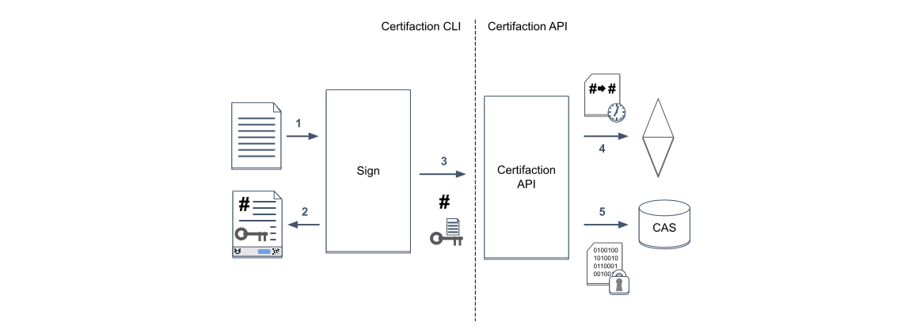
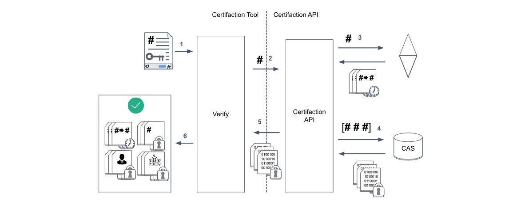
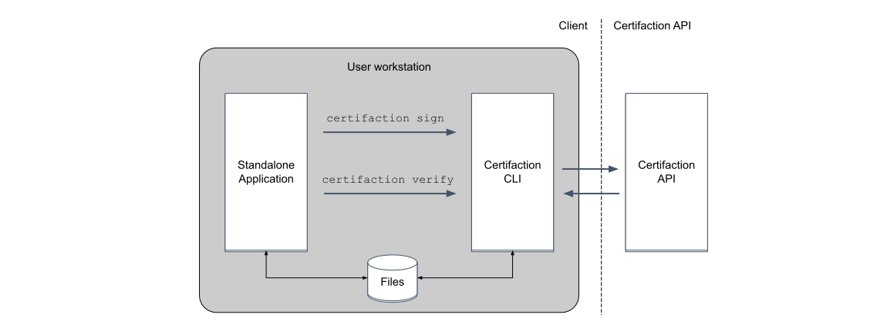
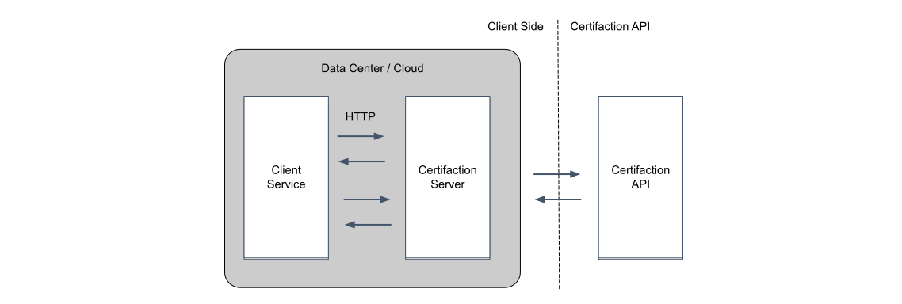

# Certifaction CLI

This is the [Certifaction](https://certifaction.com) CLI repository with the documentation and the
executables for different platform.

Direclty jump to the [Installation](#installation) section to install the CLI
for your platform.

Please create an [Issue](https://github.com/certifaction/cli/issues) to report any bug and propose new features.

**Notes**: Certifaction CLI is being developped in a fast pace and this
documentation will already contain upcoming features not yet available in the
most recent public release.  Those features will be flag with the **[Upcoming
Feature]** notation.

* [Introduction](#introduction)
* [Requirements](#requirements)
* [Principles](#principles)
  + [Document signature](#document-signature)
  + [Document verification](#document-verification)
* [Usage options](#usage-options)
  + [Standalone application integration](#standalone-application-integration)
  + [Running the HTTP server on a node](#running-the-http-server-on-a-node)
* [Authentication](#authentication)
* [Installation](#installation)
* [Interactive CLI](#interactive-cli)
* [HTTP Server Mode](#http-server-mode)

## Introduction
[Certifaction](https://certifaction.com) is the electronic signature technology for the Internet. With our
blockchain solution, we empower people and companies to sign and verify
documents in total privacy at any time, at any scale.  By integrating with our
straightforward API and tools, any business can provide the right level of
security and compliance to their processes and products.

This document
describes the Certifaction command line interface (CLI) , which provides a
command line interface and an HTTP server that can be used by third party
applications to sign and verify documents while preserving the documents’
confidentiality.

## Requirements

The CLI is distributed as an executable file compatible with recent Linux,
Windows and macOS operating systems and can be run in a Docker container.

The CLI requires access to Certifaction API and an authentication token for most
of its commands.

When using the CLI as an HTTP server,  the executable will listen to HTTP ports
which must be accessible to client applications.

## Principles
The Certifaction CLI can be used in two modes:
* Interactive to execute commands
on the shell, as part of a script or from a third party application.
* Server
mode that exposes HTTP endpoints.


In both cases, the CLI sits between the third party application and Certifaction
API and will handle document signing, verification and revocation without
leaking the document content outside the controlled IT infrastructure of the
client.


The two main functions of the CLI are document signature and verification.

### Document signature

During document signature, the CLI will:
1. Receive the PDF
document to sign and process it (add security features and the signature
footer).
2. The processed document is returned and must replace the initial
document (as this will be the document that will be signed).
3. The hash of the
file and a public key is sent to the Certifaction API for registration.
4. The
signature is timestamped in Ethereum.
5. The signature is stored encrypted in a
public database.




### Document verification

During verification, the CLl will calculate the document hash and extract the
private signature decryption key, then call Certifaction API that will find any
signature timestamp in the blockchain and return the encrypted signatures.

1. The document to verify is provided to the CLI
2. The document hash is sent to the Certifaction API
3. The verification Certifaction API will search Ethereum for all the signature timestamps for the given hash and return them.
4. The timestamps refers to encrypted signatures stored in content addressable storage (CAS).
5. Certifaction API returns the encrypted signature to the CLI since it cannot decrypt them without the private signature decryption key contained only in the document.
6. The signatures are decrypted and a verification result is returned.



## Usage options

In addition to being a useful command line utility, the CLI can be used by
standalone applications to sign documents with Certifaction without having to
integrate external libraries by calling the command line CLI to either process
documents stored in a directory or using the standard input/output.  The CLI can
also be deployed as an HTTP server container on client datacenter or cloud in
order to integrate existing document workflow with Certifaction without ever
exposing documents to the outside world.

### Standalone application integration

In this scenario, the standalone application will use the OS command execution
available to their platform to run the Certifaction commands.  The documents can
either be saved and loaded on the file system, or they can be passed to the
command using the standard input and output.




### Running the HTTP server on a node
In this scenario, the Certifaction CLI is started in server mode, either
directly in a node or VM, or inside a Docker container.  The client will use
HTTP to sign and verify documents with the guarantee that documents do not leave
the client IT system.  This is the best option for centralized document
signature where documents are signed during an automated document workflow.



## Authentication

Document signature, revocation and getting user information require authentication.
The authentication is done by passing an authentication token or an API key:

* Access tokens can be issued by you or by an external OIDC provider.  Either case, Certifaction will have to register the identity provider.
* API keys are managed from Certifaction web application.  They can only be used for server side API integration.
* For HIN Sign authentication, please follow the instructions in https://download.hin.ch/documentation/oAuth2_Dokumentation_de.pdf

## Installation
The CLI is delivered as an executable compatible with most of the usual
platform and can be found in the [Release](https://github.com/certifaction/cli/releases) 
section of this repository.

Simply download the file for your platform and install it.

Please create an [Issue](https://github.com/certifaction/cli/issues) if you do
not find an executable with your platform.

## Interactive CLI
+ [General usage](#general-usage)
+ [Checking the health of the API and its dependencies](#checking-the-health-of-the-api-and-its-dependencies)
+ [Checking the API liveliness](#checking-the-api-liveliness)
+ [Prepare a document for signing](#prepare-a-document-for-signing)
+ [Sign a document](#sign-a-document)
+ [Verify a document](#verify-a-document)
+ [Revoke a document](#revoke-a-document)
+ [Request a document signature](#request-a-document-signature)
+ [Get the authenticated user information](#get-the-authenticated-user-information)
+ [Start the HTTP server](#start-the-http-server)
      
### General usage

```
certifaction [certifaction flags] <command> [arguments]
```

The available commands are:

```
help         getting help about a command
health       return the health of the Certifaction API
ping         ping the Certifaction API
info         return the metadata of provided file
prepare      prepare a document for signing
register     register a document
sign         sign a document
verify       verify a document
revoke       revoke a document
request      request a document signature
user         return the authenticated user information
server       starts the HTTP server

```

Use `certifaction help <command>` for more information about a command.

Here are the command global flags that can be used for every command:

```
--env name      Optional environment name.  Defaults to prod.
                Will automatically setup the API URL and
                Ethereum contract addresses for a Given
                Certifaction environment.
--api URL       Overrides the default Certifaction API URL
--token         The authentication token
--api-key        An API key created in the account settings
--verbose       Increase logs verbosity. Can be repeated multiple times
                to increase it even more.
```

### Checking the health of the API and its dependencies

>#### Usage
>
>```
>certifaction health
>```
>
>#### Description
>Return the API and its dependencies health.  The result is formatted as a JSON
>array of dependency objects.  Returns an error if the API or any of its
>dependencies is not healthy.


### Checking the API liveliness

>#### Usage
>
>```
>certifaction ping
>```
>
>#### Description:
>
>Return success if the API is responsive, returns an error if not.

### Get a document metadata

>#### Usage
>
>```
>certifaction info [input | url]
>```
>
>#### Description:
>
>Retrieve metadata(salt, digital archive URL, hash and claim keys) stored from 
>the file and returns them as json

### Prepare a document for signing

>#### Usage
>
>```
>certifaction prepare [prepare flags] [-o output] [input | url]
>```
>
>#### Description
>Prepare a document for signing.  A salt and a document claim encryption key
>pair is added to the document, and optionally a branded footer.  If enabled, a
>Digital Twin QR code with a document encryption key will be added to the
>document.  If the input file is already a digital original then the command
>will return the input file unchanged.  Currently only processes PDF files.  An
>error is returned if the input is not a PDF file.  If the input parameter is
>omitted, then the command will take its input from stdin.  If the output
>parameter is omitted, then the output will be returned to stdout.
>#### Flags
>
>```
>--digital-twin     Adds a Digital Twin footer, encrypt the document and store it.
>                   Use the footer template given by the -footer parameter.
>                   If not -footer parameter is provided, then use the default footer.
>--language         Overrides the default language. Available languages are de, en, fr and it.
>```

### register a document 
>#### Usage
>```
>certifaction register [register flags] [prepare flags] [-o output] [input | url]
>```
>
>#### Description
>Digitally registers the document given as input or digitally register the
>document with the hash given with the --hash flag. The document must be
>prepared. If the document is not prepared then it will be prepared first
>before signing unless the --register-only flag is used. If the --register-only flag is
>used and the document was not prepared, then an error is returned. If the
>document is prepared during registration, then the command will honor the
>prepare command flags. If the input parameter and the --hash flag are omitted,
>then the command will take its input from stdin. The command will output the
>prepared file. If the output parameter is omitted, then the output will be
>returned to stdout.
>
>#### Flags
>```
>--scope           Optional signature scope override to choose between
>                  register, sign and certify.
>--register-only   Do not prepare the document if it is not already
>                  prepared and return an error instead.
>--hash            String, the hash of the document to sign
>```


### Sign a document 
>#### Usage
>```
>certifaction sign [sign flags] [prepare flags] [-o output] [input | url]
>```
>
>#### Description
>Digitally sign the document given as input or digitally sign the document with
the hash given with the --hash flag.  The document must  be prepared.  If the
document is not prepared then it will be prepared first before signing unless
the --sign-only flag is used.  If the --sign-only flag is used and the document
was not prepared, then an error is returned.  If the document is prepared during
signing, then the command will honor the prepare command flags. If the input
parameter and the --hash flag are omitted, then the command will take its input
from stdin.  The command will output the prepared file.  If the output parameter
is omitted, then the output will be returned to stdout.
>#### Flags
>```
>--sign-only  Do not prepare the document if it is not already
>             prepared and return an error instead.
>--hash       String, the hash of the document to sign
>```


### Verify a document
>#### Usage
>```
>certifaction verify [-o output] [input | url]
>```
>#### Description
>
>Verify the file given as input.  Return the verification result as JSON.  If
>the input parameter is omitted, then the command will take its input from
>stdin.  If the output parameter is omitted, then the output will be returned to
>stdout. Return success if the document is authentic and signed from verified
>users, otherwise returns an error.
>
### Revoke a document
>
>#### Usage
>```
>certifaction revoke [revoke flags] [input | url]
>```
>#### Description
>
>Revoke the document given as input.  The document must be a digital original
>document.  After revocation, any additional claims will be ignored during
>verification. Return an error if the document cannot be revoked.   If the input
>parameter and the -hash flag are omitted, then the command will take its input
>from stdin.
>#### Flags
>```
>--hash     string     The hash of the document to revoke
>```

### Request a document signature
>#### Usage
>```
>certifaction request [request flags] [input | url]
>```
>#### Description
>
>Create a document signature URL for the person with the given email address and name.
>The signature request URL can either be sent to the user mailbox or returned by this
>command. If the request URL is sent by email, then it is not returned by the command.
>If the input parameter is omitted, then the command will take its input from stdin.
>Returns to stdout the URL to be handed to the signer if the URL is not sent by email
>otherwise return nothing. Document have to be already registered otherwise it will 
>return an error.
>#### Flags
>```
>--name         string   Full name of signer
>--email        string   Email address of signer [required]
>--send-email   bool     When this flag is enabled API will send signing request to the user.
>```

### Get the authenticated user information
>#### Usage
>```
>certifaction user [user flags]
>```
>#### Description
>
>Return the user information as JSON.  Return an error if the user is not authenticated.

### Start the HTTP server
>#### Usage
>```
>certifaction server [server flags]
>```
>#### Description
>
>Starts Certifaction HTTP server.
>#### Flags
>```
>--port number    server port number
>```

## HTTP Server Mode

+ [General usage](#general-usage)
+ [Authentication](#authentication-1)
+ [TLS connection](#tls-connection)
+ [Common response code](#common-response-code)
+ [Get the API documentation](#get-the-api-documentation)
+ [Checking the health of the API and its dependencies](#checking-the-health-of-the-api-and-its-dependencies-1)
+ [Response](#response-1)
+ [Checking the API liveliness](#checking-the-api-liveliness-1)
+ [Prepare a document for signing](#prepare-a-document-for-signing-1)
+ [Sign a document](#sign-a-document-1)
+ [Verify a document](#verify-a-document-1)
+ [Revoke a document](#revoke-a-document-1)
+ [Request a document signature](#request-a-document-signature-1)
+ [Get the authenticated user information](#get-the-authenticated-user-information-1)


### General usage
This is the mode when the CLI is started using the `certifaction server` command
as following:

```
certifaction server [server flags]
```

The CLI will start an HTTP server at the configured port and listen to the following endpoints:

```
GET /health      Return the health of the Certifaction API
GET /ping        Ping the Certifaction API
POST /prepare    Prepare a document for signing
POST /sign       Sign a document
POST /verify     Verify a document
POST /revoke     Revoke a document
POST /request    Request a document signature
GET /user        Return the authenticated user information
GET /docs        Return the API documentation [Upcoming feature]
```

The endpoints directly mirror the CLI commands.

### Authentication
When indicated, the requests must be authenticated using the Authorization header as following:

```
Authorization: Bearer <AccessToken>
```

If the request is not authenticated a HTTP 401 Unauthorized response is returned.

### TLS connection
The server does not terminate TLS connections. If TLS is required, a proxy must be placed before the server.

### Common response code

```
400 Bad Request             Client error
401 Unauthorized            The request is not authenticated
403 Forbidden               The request is authenticated but the
                            client is not authorized
500 Internal Server Error   An unexpected server error occurred
503 Service Unavailable     Temporary service unavailability
```

### Checking the health of the API and its dependencies
>#### Usage
>```
>GET /health
>```
>#### Description
>Returns the health of Certifaction services dependency.
>#### Authenticated
>No
>#### Query parameters
>None
>### Response
>```
>200 OK    an application/json array containing service status objects
>```

### Checking the API liveliness
>#### Usage
>```
>GET /ping
>```
>#### Description
>Return success if the API is running
>#### Authenticated
>No
>#### Query parameters
>None
>#### Response
>```
>200 OK    No content
>```


### Prepare a document for signing
>#### Usage
>```
>POST /prepare
>```
>#### Description
>Take the input file and prepare it for signing.  A salt and a document claim
>encryption key pair is added to the document, and optionally a branded footer.
>If enabled, a Digital Twin QR code with a document encryption key will be added
>to the document.  The resulting document is called a digital original.  If the
>input file is already a digital original then the command will return the input
>file unchanged.  Currently only processes PDF files.  An error is returned if
>the input is not a PDF file.
>#### Authenticated
>Yes
>#### Header
>```
>Accept-Language: used to select the right footer language
>```
>#### Query parameters
>```
>digital-twin=true: activates the Digital Twin feature
>```
>#### Response
>```
>200 OK    the prepared application/pdf file
>```
>#### Body
>An application/pdf body containing the document to prepare

### Register a document
>#### Usage
>```
>POST /register
>```
>#### Description
>Digitally registers the document given as input.  The document must be a digital
>original, i.e. it must have been prepared with the prepare command.  If the
>document is not a digital original, then it will be prepared first before
>signing unless the register-only flag is used.  If the register-only flag is used and the
>document was not prepared, then an error is returned.  If the document is
>prepared during registering, then the command will honor the prepare query
>parameters.
>#### Authenticated
>Yes
>#### Header
>```
>Accept-Language: used to select the right footer language
>```
>#### Query parameters
>```
>scope=<string>: overrides the default user signing scope.  The possible values are register, sign and certify
>register-only=true: do not prepare the document if it is not prepared and return an error instead.
>hash=<string>: the hash of the document to sign
>filename=<string>: the name of the file
>
>In addition, the query will accept the prepare query parameters.
>```
>#### Response
>```
>200 OK    the signed application/pdf file
>```
>#### Body
>An application/pdf body containing the document to register

### Sign a document
>#### Usage
>```
>POST /sign
>```
>#### Description
>Digitally sign the document given as input.  The document must be a digital
>original, i.e. it must have been prepared with the prepare command.  If the
>document is not a digital original, then it will be prepared first before
>signing unless the sign-only flag is used.  If the sign-only flag is used and the
>document was not prepared, then an error is returned.  If the document is
>prepared during signing, then the command will honor the prepare query
>parameters.
>#### Authenticated
>Yes
>#### Header
>```
>Accept-Language: used to select the right footer language
>```
>#### Query parameters
>```
>sign-only=true: do not prepare the document if it is not prepared and return an error instead.
>hash=<string>: the hash of the document to sign
>filename=<string>: the name of the file
>
>In addition, the query will accept the prepare query parameters.
>```
>#### Response
>```
>200 OK    the signed application/pdf file
>```
>#### Body
>An application/pdf body containing the document to sign

### Verify a document
>#### Usage
>```
>POST /verify
>```
>#### Description
>Verify the file given as input.  Return the verification result as JSON.
>#### Authenticated
>No
>#### Header
>None
>#### Query parameters
> None
>#### Response
>```
>200 OK    the application/json verification result
>```
>#### Body
>An application/pdf body containing the document to verify
>##### Example
>
>Verification result:
>```json
>{
>  "on_blockchain": true,
>  "issuer_img": "https://example.com/images/verified_by_acme.png",
>  "issuer_verified": true,
>  "issuer_title": "",
>  "file": {
>    "hash": "0x61c2ec21338308bb9283917041db4a70dee2c9d3258228d8c6039d5b431a1653",
>    "status": "registered",
>    "claim_key": "044aa7b14f1538954c83062083da2db3e41d4d7cb75f7069baeffbbf45f1adcad091c0113fb440ed848d01c667022c73806b8f26622b4562daabdb6dfc87d4b543",
>    "txHash": "0x64f4b4f5a0baa42f529efe1e2d8f0d2b41481b9b236698f20a92680bf60e386f",
>    "registered_at": "2021-01-14T09:53:59Z"
>  },
>  "revoked": false,
>  "encrypted": true,
>  "claims": [
>    {
>      "@context": "https://schema.certifaction.io/encryptedclaim/v1",
>      "@id": "cert:hash:0x61c2ec21338308bb9283917041db4a70dee2c9d3258228d8c6039d5b431a1653",
>      "algorithm": "ECIES",
>      "claim": "BHnbTfqOfN93h+lT0fbFdpFareoWq293lopv000HLk9K8EZ5aXUYXXmpx6y9hV7RTgHXQfkgzj/Km3tjOOxrzWpUxQ1JLPHqaTqE0DMzhEV97/UXk1ooF/nlV/fwyhg+zRnoqJWmcUMpB/Rdamu0Ur4pfNVB8VKbr5WFQlDNWrXjFQfWFqH66JebSThX0HcGqcAldxc8yGo5r0rHBcnFQxbZPu/SzxFcsc7fg9IfQaYp1FOyBBYfAJlhbLCtn0ahdb2IKynjltqqLSWpyx8rWq+1CsN4SHfQYE1+XfOhitU+wlsNbj5vhO4Q2t4l8jZyThrEWcc7cVindVmc6cdziAI/nTbDuQ+aj0GN5Gwb0jiR3MP9CNeUKU9vg+Twx4I1W/inOlpYYAuJ8MDz1Kcr58g4FpSIBL4v43rk6ZDfX9I/bMclc3O+HFotmAWoTGWcxfqCKdTSR2PoOw9pmyNd3oPbNQSOXuWGDrbLE2mZB7hR76VIWHe18Pgd6gATsaFqIcnyVGY1OIrcbpMn1cDfMNoeWTd7rg/mjbPztYW5VT/U7oar4jTAiqaZQZpNC7HFypz2DwV6cnDxNnaoVYJMZzia0UmNaW5+WYKVykAueh376OH52FQjt1MAF4jl3bn8l7V0RPHN6Ma4M82/xMb+k+ELucJI8MAVZvqOeobZbATVSadZFbtEw3vykHsPNCuF50SA9FiFELVFSp7CQwpn2k9HR6EM90D6pdtL/QL+q5HFE1iMzUopQyg3Klebpxz9zpOfrIThSTLBwwcr6HiLkbu9A+NpAIwpxqkhKUiOjWeGYeP9nKDQ1Ez6ltqm9dKhpcFci/C+1403b687FEFuk1yrf3znaPzDwjU6gKBmbAFqJRpurnyow+h9+t/F0eFqHBFZSuJrsqf467WTvEewlvuB+yc6cf/DSPnf7mX7u56AJ+amMLkTyn6plC0nD3bTzXYSAWkV1UhSb9Yb7Q/Wj0B6s7YtEgs/3pdEssLGx2nABZa0W4uxQDpejYozX8PBeedZ/S5zW5nfItnFgqVNZOBm5+r9QO2DVGhKJXATDsqORuAbLg/AZlmQv/gSSo6Or0pa7g0kRmy0eS7LDf17KFK27Jec5vv0FAc69/DPtt/CG8b9kcdMVwnjMRnhkcwJhuU1ehubDxqBKvq6iPYLZiOZYvdjE6Fqo4Kxn66mmhNdoHVbmhFYF1FpPE74I9xV2vn6xIvPw70C60yaWe8r+bxDUKdBzIWX1SFWYzUaGMiKlxBuTKSkiqXT3frNzuHqd7A48luk2gNQEOk2o73lnjXkNgEELjPo+CynS94g+g/EoRey+aqnVPfDQaRyfcmBsUwJOKeOf6O0VBaeV9/PxDf7Cg=="
>    }
>  ]
>}
>```
>
>##### Explanation of essential fields:
>Field | Description
>----- | -----------
>on_blockchain | Indicates whether the file has been registered on the blockchain
>issuer_img| Optionally has a path to an image or logo of the issuer
>issuer_verified| Defines whether the issuer identity has been verified
>file.hash| Hash of the file
>file.status| Temporary status of the file in our database ('registered', 'revoked', 'registering', 'revoking'). Might temporarily differ from status on blockchain until the file has definitely been confirmed on the blockchain. For verification use on_blockchain and revoked fields instead.
>file.txHash| Transaction hash of the registration on the blockchain. Can be checked for example on https://etherscan.io.
>file.registered_at| Time when file has been registered.
>revoked| Indicates whether the file has been revoked on the blockchain. If a file has been revoked it will have on_blockchain: true
>encrypted| Indicates where the data under claims is encrypted for privacy reasons
>claims| Claims about the file. Claims have already been verified before returning the result but can optionally be verified by the consumer.

### Revoke a document
>#### Usage
>```
>POST /revoke
>```
>#### Description
>Revoke the document given as input.  The document must be a digital original document.  After revoking, any additional claims will be ignored during verification. Return an error if the document cannot be revoked.
>#### Authenticated
>Yes
>#### Header
>None
>#### Query parameters
>None
>#### Response
>```
>200 OK    no content
>```
>#### Body
>An application/pdf body containing the document to revoke

### Request a document signature
>#### Usage
>```
>POST /request
>```
>#### Description
>Return a signature request URL from a Digital Twin document.  The URL can be shared with other people to sign a document.   The document must be a digital original document and will return an error otherwise.
>#### Authenticated
>Yes
>#### Header
>None
>#### Query parameters
>```
>name=<string>:    full name of signer
>email=<string>:   email address of signer
>send-email=true:  when this flag is enabled API will send signing request to the user.
>```
>#### Response
>```
>200 OK    an application/json containing the resulting request URL
>```
>
>#### Body
>An application/pdf body containing the document for which a signature is requested
>##### Example
>```json
>{
>    "request_url":"<the URL to be handed to the signer>"
>}
>```

### Get the authenticated user information
>#### Usage
>```
>GET /user
>```
>#### Description
>Return the user information as JSON.
>#### Authenticated
>Yes
>#### Header
>None
>#### Query parameters
>None
>#### Response
>```
>200 OK    an application/json user object
>```
>#### Body
>An application/pdf body containing the document for which a signature is requested
>##### Example
>```json
>{
>  "id": 506,
>  "uuid": "GzOysSHa8EB",
>  "external_id": "5fe0a47220148a00686f055a",
>  "email": "hans.muster@certifaction.com",
>  "name": "Hans Muster",
>  "eth_address": "0x124bf6e60b4ec8dc7bc314aaca4ab09dc4da1ecd",
>  "quota": 2,
>  "subscription_type": "credits",
>}
>```
>
>##### Explanation of essential fields:
>Field | Description
>----- | -----------
>email| Email address of the user
>quota| The amount of credits the user has left to register or revoke files if the subscription type is credits.
>subscription_type| The subscription type of the user. Can be credits or flat_rate

### Get the API documentation [Upcoming feature]
>#### Usage
>```
>GET /docs
>```
>#### Description
>Return the API documentation that was generated from a swagger file.  The source swagger file URL can be found in the page
>
>#### Authenticated
>No
>#### Query parameters
>None
>#### Response
>```
>200 OK    Returns the text/html documentation file
>```
