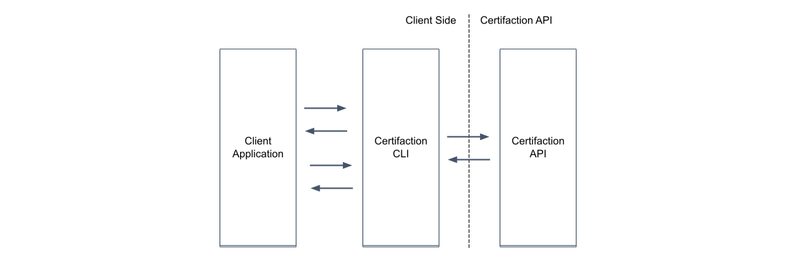

# Certifaction CLI

This is the [Certifaction](https://certifaction.com) CLI repository with the documentation and the
executables for different platforms.

Directly jump to the [Installation](#installation) section to install the CLI
for your platform.

Please create an [Issue](https://github.com/certifaction/cli/issues) to report any bug and propose new features.

**Notes**: Certifaction CLI is being developed at a fast pace and this
documentation will already contain upcoming features not yet available in the
most recent public release. Those features will be flagged with the **\[Upcoming
Feature]** notation.

*   [Introduction](#introduction)
*   [Requirements](#requirements)
*   [Functionality](#functionality)
*   [Document signature](#document-signature)
    *   [Simple Document signature](#simple-document-signature)
    *   [Document Digital Twin](#document-digital-twin)
    *   [Document signature request](#document-signature-request)
*   [Usage options](#usage-options)
    *   [Standalone application integration](#standalone-application-integration)
    *   [Running the HTTP server on a node](#running-the-http-server-on-a-node)
*   [Authentication](#authentication)
*   [Installation](#installation)
*   [Interactive CLI](#interactive-cli)
*   [HTTP Server Mode](#http-server-mode)

## Introduction

[Certifaction](https://certifaction.com) is the electronic signature technology for the Internet. With our solution,
we empower people and companies to sign and verify
documents in total privacy at any time, at any scale. By integrating with our
straightforward API and tools, any business can provide the right level of
security and compliance to their processes and products.

This document
describes the Certifaction command line interface (CLI) , which provides a
command line interface and an HTTP server that can be used by third party
applications to sign and verify documents while preserving the documents’
confidentiality.

## Requirements

The CLI is distributed as an executable file compatible with recent Linux,
Windows and macOS operating systems and can be run in a Docker container.

The CLI requires access to the Certifaction API and an authentication token for most
of its commands.

When using the CLI as an HTTP server, the executable will listen to HTTP ports
which must be accessible to client applications.

## Functionality

The CLI provides three main functionalities for your documents:

*   Digital signatures
*   Certification
*   Verification

The certification and verification functionality is detailed in the [Blockchain certification](blockchain_certification.md) page.
The rest of this document will focus on the document digital signature.

## Document signature

Certifaction digital signature allows client to add one or more digital signatures to PDF documents.

Client can also invite other people to sign documents by providing them with secure document URLs
containing a secret key.  The secret key will decrypt the document before signing, ensuring that
Certifaction never access the document in clear text.

Certifaction document signature is based on the [PAdES](https://en.wikipedia.org/wiki/PAdES) standard,
which uses cryptography and the public PKI infrastructure to provides the highest guarantee against forgery.

Certifaction uses three signature levels with increasing identity verification assurances:

*   Standard Electronic Signature (SES): email verification
*   Professional Electronic Signature (PES): identification using ID document scanning and verification
*   Qualified Electronic Signature (QES): Swiss and EU qualified electronic signature requirements

Certifaction unique privacy-first signature ensures that document content does not leave your
IT infrastructure in clear text without your consent.

### Simple document signature

Here are the steps during a simple document signature:

1.  The CLI Receives the PDF
    document to sign and process it (add security features including a unique secure URL and one or more signature
    pages).
2.  The hash of the
    file is sent to Certifaction API for signature
3.  Certifaction API uses one of its pluggable signature provider depending on the signature level and jurisdiction
4.  Certifaction API returns the PKCS #7 CMS signature to the CLI
5.  The CLI embeds the signature in the PDF document and returns to the Client

Additional signatures can be appended to an already signed document sequentially.  Sending a signed document to an
other signer is a simple and valid option.


### Document Digital Twin

In addition to storing the secure URL inside the PDF as custom information.  A Digital Twin QR code can be added
to the document.  This QR code contains the secure URL that can be used to retrieve the encrypted version of
document stored in Certifaction servers.

When printing the document, the visible QR code can be scanned to retrieve the last version of the document.
Certifaction Digital Twin bridges the world of printed and digital documents.

Here are the steps to store an encrypted version of the document and return a Digital Twin URL:

1.  Before signature, a unique and secure URL created and added to the document with a QR code
2.  The document is encrypted
3.  The encrypted copy is stored in Certifaction Digital Archive (DA)
4.  The Digital Twin URL is recorded in Certifaction document locator


### Document signature request

Certifaction document signature request rely on the Certifaction Digital Archive to store end-to-end encrypted
document.

During a signature request, the CLI will:

1.  Receive the PDF
    document to sign and the signer information
2.  Processe the document, adding security features including the secure Digital Twin URL
3.  Encrypt the document using the secret key contained in the Digital Twin URL
4.  Store the document in Certifaction Digital Archive for later retrieval.
5.  Return the secure URL

The Digital Twin URL can be shared with the invited person.  A new URL must be created for each signer.
Since the URL contains a secret, access to its content must be protected as well as would be the original document.

## Usage options

The Certifaction CLI can be used in two modes:

*   Interactive to execute commands
    on the shell, as part of a script or from a third party application.
*   Server
    mode that exposes HTTP endpoints.

In both cases, the CLI sits between the third party application and the Certifaction
API and will handle document signing, certification, verification and revocation without
leaking the document content outside the controlled IT infrastructure of the
client.



In addition to being a useful command line utility, the CLI can be used by
standalone applications to sign and certify documents with Certifaction without having to
integrate and link to external libraries.

An application can call the CLI to either process
documents stored in a directory or using the standard input/output. The CLI can
also be deployed as an HTTP server container in the client's datacenter or cloud in
order to integrate existing document workflows with Certifaction without ever
exposing documents to the outside world.

### Standalone application integration

In this scenario, the standalone application will use the OS command execution
available to their platform to run the Certifaction commands. The documents can
either be saved and loaded on the file system, or they can be passed to the
command using the standard input and output.


### Running the HTTP server on a node

In this scenario, the Certifaction CLI is started in server mode, either
directly in a node or VM, or inside a Docker container. The client will use
HTTP to sign and verify documents with the guarantee that documents do not leave
the client IT system. This is the best option for centralized document
signature where documents are signed during an automated document workflow.


## Authentication

Document signature, revocation and getting user information require authentication.
The authentication is done by passing an authentication token or an API key:

*   Access tokens can be issued by you or by an external OIDC provider.  Either case, Certifaction will have to register the identity provider.
*   API keys are managed from the Certifaction web application.  They can only be used for server side API integration.
*   For HIN Sign authentication, please follow the instructions:
    *   [German](https://download.hin.ch/documentation/oAuth2_Dokumentation_de.pdf)
    *   [French](https://download.hin.ch/documentation/oAuth2_Dokumentation_fr.pdf)

## Proxy settings
The CLI integrates with Certifaction API using HTTPS. If the deployment is behind a proxy you must configure the proxy using an environment variable.

The proxy can be configured by setting the `HTTP_PROXY`, `HTTPS_PROXY` and `NO_PROXY` (or the lowercase versions thereof).
HTTPS_PROXY takes precedence over HTTP_PROXY for https requests.

The environment values may be either a complete URL or a "host[:port]", in which case the "http" scheme is assumed.
The schemes "http", "https", and "socks5" are supported. An error is returned if the value is a different form.

## Installation

The CLI is delivered as an executable compatible with most of the usual
platforms and can be found in the [Release](https://github.com/certifaction/cli/releases)
section of this repository.

Simply download the file for your platform and install it.

Please create an [Issue](https://github.com/certifaction/cli/issues) if you do
not find an executable for your platform.

## Interactive CLI

*   [General usage](#general-usage)
*   [Checking the health of the API and its dependencies](#checking-the-health-of-the-api-and-its-dependencies)
*   [Checking the API liveliness](#checking-the-api-liveliness)
*   [Prepare a document for signing](#prepare-a-document-for-signing)
*   [Sign a document](#sign-a-document)
*   [Retract a document](#retract-a-document)
*   [Request a document signature](#request-a-document-signature)
*   [Cancel a document signature request](#cancel-a-document-signature-request)
*   [Get the authenticated user information](#get-the-authenticated-user-information)
*   [Export data](#export-data)
*   [Check QES status](#check-qes-status)
*   [Start the HTTP server](#start-the-http-server)

### General usage

    certifaction [certifaction flags] <command> [arguments]

The available commands are:

```
help                getting help about a command
delete-access       remove Certifaction access to the file
download            download and decrypt document from digital archive
export              export data
health              return the health of the Certifaction API
info                return the metadata of provided file
ping                ping the Certifaction API
info                return the metadata of provided file
prepare             prepare a document for signing
qes check           returns whether the current user is QES enabled
sign                sign a document
request cancel      cancel a signature request
request cancel-all  cancel signing of the document
request create      request a document signature
request edit        edit a signature request
request list        list signature requests for a document
user                return the authenticated user information
server              starts the HTTP server

```

Use `certifaction help <command>` for more information about a command.

Here are the command global flags that can be used for every command:

    --env <name>      Optional environment name.  Defaults to prod.
                      Will automatically setup the API URL and
                      for a given Certifaction environment.
    --api <URL>       Overrides the default Certifaction API URL
    --token <access token>    The authentication token.  Please ensure that you
                              surround the token with quotes as it could contain
                              special characters.
    --api-key <api key>       An API key created in the account settings
    --verbose       Increase logs verbosity. Can be repeated multiple times
                    to increase it even more.

### Deleting Certifaction access to the file

> #### Usage
>
>     certifaction delete-access [input file | URL]
>
> #### Description
>
> This makes files inaccessible for the Certifaction system for further processing.
> Because of that it will no longer be possible to download files from the collection page
> or request new signatures, although it will still be possible to access them
> through the original signature request emails.

### Download file from digital archive

> #### Usage
>
>     certifaction download [DA URL]
>
> #### Description
>
> Downloads document from the digital archive and then decrypts it.

### Checking the health of the API and its dependencies

> #### Usage
>
>     certifaction health
>
> #### Description
>
> Returns the API and its dependencies' health. The result is formatted as a JSON
> array of dependency objects. Returns an error if the API or any of its
> dependencies is not healthy.

### Checking the API liveliness

> #### Usage
>
>     certifaction ping
>
> #### Description:
>
> Returns success if the API is responsive, returns an error if not.

### Get document metadata

> #### Usage
>
>     certifaction info [input | url]
>
> #### Description:
>
> Retrieves metadata (salt, digital archive URL, hash and claim keys) stored from
> the file and returns them as a JSON.

### Prepare a document for signing

> #### Usage
>
>     certifaction prepare [prepare flags] [-o output] [input | url]
>
> #### Description
>
> Prepares a document for signing. A salt and a document claim encryption key
> pair is added to the document, and optionally a branded footer. If enabled, a
> Digital Twin QR code with a document encryption key will be added to the
> document. If the input file is already a digital original then the command
> will return the input file unchanged. Currently only processes PDF files. An
> error is returned if the input is not a PDF file. If the input parameter is
> omitted, then the command will take its input from stdin. If the output
> parameter is omitted, then the output will be returned to stdout.
>
> #### Flags
>
>     --digital-twin     Adds a Digital Twin footer, encrypts the document and stores it.
>                       Uses the footer template given by the -footer parameter.
>                       If no -footer parameter is provided, then the default footer is used.
>     --language         Overrides the default language. Available languages are de, en, fr and it.
>     --scope            Optional signature scope override to choose between
>                       register, sign and certify.

### Sign a document

> #### Usage
>
>     certifaction sign [sign flags] [prepare flags] [-o output] [input | url]
>
> #### Description
>
> Digitally sign the document given as input or digitally sign the document with
> the hash given with the --hash flag. The document must be prepared. If the
> document is not prepared then it will be prepared first before signing unless
> the --no-prepare flag is used. If the --no-prepare flag is used and the document
> was not prepared, then an error is returned. If the document is prepared during
> signing, then the command will honor the prepare command flags. If the input
> parameter and the --hash flag are omitted, then the command will take its input
> from stdin. The command will output the prepared file. If the output parameter
> is omitted, then the output will be returned to stdout.
>
> #### Flags
>
>     --no-prepare      Do not prepare the document if it is not already
>                      prepared and return an error instead.
>     --hash            String, the hash of the document to sign
>     --legal-weight    Allows to select type of the signature. Possible values are
>                      "standard" and "QES". Defaults to "standard".
>     --jurisdiction   Only valid with "QES" signature, currently the only supported
>                      value is "ZertES"

### Retract a document

> #### Usage
>
>     certifaction retract [retract flags] [input | url]
>
> #### Description
>
> Digitally mark the document given as input as retracted. The document must be
> already signed. If the input parameter and the --hash flag are omitted, then
> the command will take its input from stdin. All signature requests for given file
> will be canceled.
>
> #### Flags
>
>     --hash            String, the hash of the document to retract
>     --note            Optional note to be saved together with the signature

### Request a document signature

> #### Usage
>
>     certifaction request create [request flags] [input | url]
>
> #### Description
>
> Create a document signature URL for the person with the given email address and name.
> The signature request URL can either be sent to the user mailbox or returned by this
> command. If the request URL is sent by email, then it is not returned by the command.
> If the input parameter is omitted, then the command will take its input from stdin.
> Returns to stdout the URL to be handed to the signer if the URL is not sent by email
> otherwise return nothing. Document have to be already registered otherwise it will
> return an error.
>
> #### Flags
>
>     --name         string   Full name of the signer
>     --email        string   Email address of the signer [required]
>     --send-email   bool     When this flag is enabled the API will send a signing request to the user

### Edit a document signature request

> #### Usage
>
>     certifaction request edit [input file | URL] [flags]
>
> #### Description
>
> Allows changing the email address and/or name for a given signature request for a given
> document. If the input parameter is omitted, then the command will take its
> input from stdin.
>
> #### Flags
>
>     --email string       Current email address of the signer. [required]
>     --new-email string   New email address of the signer.
>     --new-name string    New name of the signer.

### List document signature requests

> #### Usage
>
>     certifaction request list [input file | URL]
>
> #### Description
>
> Lists all sent signature requests and their status for a given document.

### Cancel a document signature request

> #### Usage
>
>     certifaction request cancel [request cancel flags] [input | url]
>
> #### Description
>
> Cancels a signature request for a given file for the user with a given e-mail address.
>
> #### Flags
>
>     --email        string   Email address of the signer [required]
>     --note         string   Note to be sent to the invitee explaining why the request
>                            was cancelled

### Cancel a document signing process

> #### Usage
>
>     certifaction request cancel-all [input file | URL] [flags]
>
> #### Description
>
> Cancels all signature requests for a given document. If the input parameter is omitted, then the command will take its input from stdin.
>
> #### Flags
>
>     --note         string   Note to be sent to the invitee explaining why the request
>                            was cancelled

### Get the authenticated user information

> #### Usage
>
>     certifaction user [user flags]
>
> #### Description
>
> Returns the user information as a JSON. Returns an error if the user is not authenticated.

### Check QES status

> #### Usage
>
>     certifaction qes check [qes check flags]
>
> #### Description
>
> Returns true or false depending on a user's QES status. If the user is QES enabled, it will return exit code 0, otherwise 1.
>
> #### Flags
>
>     --jurisdiction string   Jurisdiction. For example: eIDAS or ZertES

### Start the HTTP server

> #### Usage
>
>     certifaction server [server flags]
>
> #### Description
>
> Starts the Certifaction HTTP server.
>
> #### Flags
>
>     --port number    server port number

## HTTP Server Mode

*   [General usage](#general-usage)
*   [Authentication](#authentication-1)
*   [TLS connection](#tls-connection)
*   [Common response code](#common-response-code)
*   [Get the API documentation](#get-the-api-documentation)
*   [Checking the health of the API and its dependencies](#checking-the-health-of-the-api-and-its-dependencies-1)
*   [Response](#response-1)
*   [Checking the API liveliness](#checking-the-api-liveliness-1)
*   [Prepare a document for signing](#prepare-a-document-for-signing-1)
*   [Sign a document](#sign-a-document-1)
*   [Verify a document](#verify-a-document-1)
*   [Revoke a document](#revoke-a-document-1)
*   [Request a document signature](#request-a-document-signature-1)
*   [Get the authenticated user information](#get-the-authenticated-user-information-1)

### General usage

This is the mode when the CLI is started using the `certifaction server` command
as following:

    certifaction server [server flags]

The CLI will start an HTTP server at the configured port and listen to the following endpoints:

    GET  /health          Returns the health of the Certifaction API
    GET  /ping            Pings the Certifaction API
    POST /prepare         Prepares a document for signing
    POST /sign            Signs a document
    POST /retract         Retracts a document
    POST /download        Downloads and decrypts a document from the digital archive
    POST /delete-access   Removes Certifaction access to the file
    POST /request/create  Requests a document signature
    POST /request/edit    Edits a signature request
    POST /request/cancel  Cancels a signature request
    POST /request/cancel/all  Cancels signing of the document
    POST /request/list        Lists signature requests for a document
    GET  /user            Returns the authenticated user information
    POST /qes/check       Checks whether the current user is QES enabled
    GET  /docs            Returns the API documentation [Upcoming feature]

The endpoints directly mirror the CLI commands.

### Authentication

When indicated, the requests must be authenticated using the Authorization header as following:

    Authorization: Bearer <AccessToken>

If the request is not authenticated a HTTP 401 Unauthorized response is returned.

### TLS connection

The server does not terminate TLS connections. If TLS is required, a proxy must be placed before the server.

### Common response code

    400 Bad Request             Client error
    401 Unauthorized            The request is not authenticated
    403 Forbidden               The request is authenticated but the
                                client is not authorized
    500 Internal Server Error   An unexpected server error occurred
    503 Service Unavailable     Temporary service unavailability

### Checking the health of the API and its dependencies

> #### Usage
>
>     GET /health
>
> #### Description
>
> Returns the health of Certifaction services dependency.
>
> #### Authenticated
>
> No
>
> #### Query parameters
>
> None
>
> ### Response
>
>     200 OK    an application/json array containing service status objects

### Checking the API liveliness

> #### Usage
>
>     GET /ping
>
> #### Description
>
> Returns success if the API is running.
>
> #### Authenticated
>
> No
>
> #### Query parameters
>
> None
>
> #### Response
>
>     200 OK    No content

### Prepare a document for signing

> #### Usage
>
>     POST /prepare
>
> #### Description
>
> Takes the input file and prepares it for signing. A salt and a document claim
> encryption key pair is added to the document, and optionally a branded footer.
> If enabled, a Digital Twin QR code with a document encryption key will be added
> to the document. The resulting document is called a digital original. If the
> input file is already a digital original then the command will return the input
> file unchanged. Currently only processes PDF files. An error is returned if
> the input is not a PDF file.
>
> #### Authenticated
>
> Yes
>
> #### Header
>
>     Accept-Language: used to select the right footer language
>
> #### Query parameters
>
>     digital-twin=true: activates the Digital Twin feature
>     scope=<string>: overrides the default user signing scope. The possible values are register, sign and certify
>
> #### Response
>
>     200 OK    the prepared application/pdf file
>
> #### Body
>
> An application/pdf body containing the document to prepare

### Sign a document

> #### Usage
>
>     POST /sign
>
> #### Description
>
> Digitally sign the document given as input.  The document must be a digital
> original, i.e. it must have been prepared with the prepare command.  If the
> document is not a digital original, then it will be prepared first before
> signing unless the no-prepare flag is used.  If the no-prepare flag is used and the
> document was not prepared, then an error is returned.  If the document is
> prepared during signing, then the command will honor the prepare query
> parameters.
>
> #### Authenticated
>
> Yes
>
> #### Header
>
>     Accept-Language: used to select the right footer language
>
> #### Query parameters
>
>     no-prepare=true: do not prepare the document if it is not prepared and return an error instead.
>     hash=<string>: the hash of the document to sign
>     filename=<string>: the name of the file
>     legal-weight=<string>: allows to select type of the signature. Posible values are "standard" and "QES". Defaults to "standard".
>     jurisdinction=<string>: only valid with "QES" signature, currently only supported value is "ZertES"
>
>     In addition, the query will accept the prepare query parameters.
>
> #### Response
>
>     200 OK    the signed application/pdf file
>
> #### Body
>
> An application/pdf body containing the document to sign

### Retract a document

> #### Usage
>
>     POST /retract
>
> #### Description
>
> Retracts the document given as input. The document must be
> a digital original document. After retraction, all signature
> requests are cancelled. Returns an error if the document cannot
> be retracted.
>
> #### Authenticated
>
> Yes
>
> #### Header
>
> None
>
> #### Query parameters
>
> ```
> hash=<string>: the hash of the document to sign
> filename=<string>: the name of the file
> note=<string>: additional note to be stored in claim
>
> ```
>
> #### Response
>
>     200 OK    the signed application/pdf file
>
> #### Body
>
> An application/pdf body containing the document to retract

### Download file from digital archive

> #### Usage
>
>     GET /download
>
> #### Description
>
> Downloads document from the digital archive and then decrypts it.
>
> #### Authenticated
>
> No
>
> #### Query parameters
>
> file=<string>:    digital archive URL
>
> ### Response
>
>     200 OK    An application/pdf body containing the document

### Delete Certifaction access to the file

> #### Usage
>
>     GET /delete-access
>
> #### Description
>
> This makes files inaccessible for the Certifaction system for further processing.
> Because of that it will no longer be possible to download files from the collection page
> or request new signatures, although it will still be possible to access them
> through the original signature request emails.
>
> #### Authenticated
>
> Yes
>
> #### Body
>
> An application/pdf body containing the document for which a signature is requested
>
> ### Response
>
>     200 OK    An application/pdf body containing the document

### Request a document signature

> #### Usage
>
>     POST /request/create
>
> #### Description
>
> Create a document signature URL for the person with the given email address and name.
> The signature request URL can either be sent to the user mailbox or returned by this
> command. If the request URL is sent by email, then it is not returned by the command.
> If the input parameter is omitted, then the command will take its input from stdin.
> Returns to stdout the URL to be handed to the signer if the URL is not sent by email
> otherwise return nothing. Document have to be already registered otherwise it will
> return an error.
>
> #### Authenticated
>
> Yes
>
> #### Header
>
> None
>
> #### Query parameters
>
>     name=<string>:    Full name of the signer
>     email=<string>:   Email address of the signer
>     send-email=true:  When this flag is enabled the API will send a signing request to the user
>
> #### Response
>
>     200 OK    an application/json containing the resulting request URL
>
> #### Body
>
> An application/pdf body containing the document for which a signature is requested
>
> ##### Example
>
> ```json
> {
>    "request_url":"<the URL to be handed to the signer>"
> }
> ```

### Edit a document signature request

> #### Usage
>
>     POST /request/edit
>
> #### Description
>
> Allows changing the email address and/or name for a given signature request for a given
> document. If the input parameter is omitted, then the command will take its
> input from stdin.
>
> #### Authenticated
>
> Yes
>
> #### Header
>
> None
>
> #### Query parameters
>
>     email=<string>:      Current email address of signer.
>     new-name=<string>:   New name of the signer.
>     new-emain=<string>:  New email address of the signer.
>
> #### Response
>
>     200 OK 
>
> #### Body
>
> An application/pdf body containing the document for which a signature is requested

### List document signature requests

> #### Usage
>
>     POST /request/list
>
> #### Description
>
> Lists all sent signature requests and their status for a given document.
>
> #### Authenticated
>
> Yes
>
> #### Header
>
> None
>
> #### Response
>
>     200 OK  A JSON object representing all signature requests for the file.
>
> #### Body
>
> An application/pdf body containing the document for which a signature is requested

### Cancel a document signature request

> #### Usage
>
>     POST /request/cancel
>
> #### Description
>
> Cancels a signature request for a given document for the person with the given email address.
>
> #### Authenticated
>
> Yes
>
> #### Header
>
> None
>
> #### Query parameters
>
>     email=<string>:   email address of signer
>     note=<string>:   Note to be sent to the invitee explaining why the request was cancelled.
>
> #### Response
>
>     204 No Content
>
> #### Body
>
> An application/pdf body containing the document for which a signature request should be cancelled

### Cancel a document signing process

> #### Usage
>
>     POST /request/cancel/all
>
> #### Description
>
> Cancels all signature request for a given document. If the input parameter is omitted, then the command will take its input from stdin.
>
> #### Authenticated
>
> Yes
>
> #### Header
>
> None
>
> #### Query parameters
>
>     note=<string>:   Note to be sent to the invitee explaining why the request was cancelled.
>
> #### Response
>
>     204 No Content
>
> #### Body
>
> An application/pdf body containing the document for which a signature is requested

### Get the authenticated user information

> #### Usage
>
>     GET /user
>
> #### Description
>
> Returns the user information as a JSON.
>
> #### Authenticated
>
> Yes
>
> #### Header
>
> None
>
> #### Query parameters
>
> None
>
> #### Response
>
>     200 OK    an application/json user object
>
> #### Body
>
> An application/pdf body containing the document for which a signature is requested
>
> ##### Example
>
> ```json
> {
>  "id": 506,
>  "uuid": "GzOysSHa8EB",
>  "external_id": "5fe0a47220148a00686f055a",
>  "email": "hans.muster@certifaction.com",
>  "name": "Hans Muster",
>  "eth_address": "0x124bf6e60b4ec8dc7bc314aaca4ab09dc4da1ecd",
>  "quota": 2,
>  "subscription_type": "credits"
> }
> ```
>
> ##### Explanation of essential fields:
>
> Field | Description
> \----- | -----------
> email| Email address of the user
> quota| The amount of credits the user has left to register or revoke files if the subscription type is credits.
> subscription\_type| The subscription type of the user. Can be credits or flat\_rate

### Get the API documentation \[Upcoming feature]

> #### Usage
>
>     GET /docs
>
> #### Description
>
> Returns the API documentation that was generated from a swagger file. The source swagger file URL can be found in the page.
>
> #### Authenticated
>
> No
>
> #### Query parameters
>
> None
>
> #### Response
>
>     200 OK    Returns the text/html documentation file
