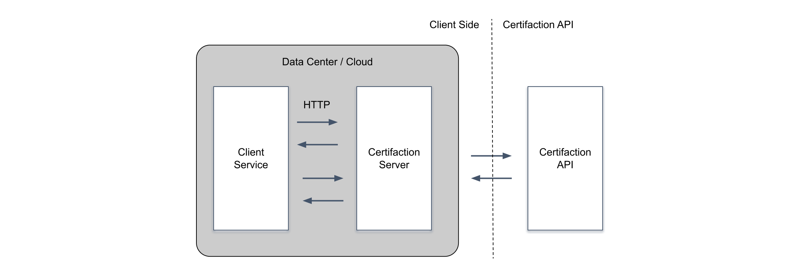
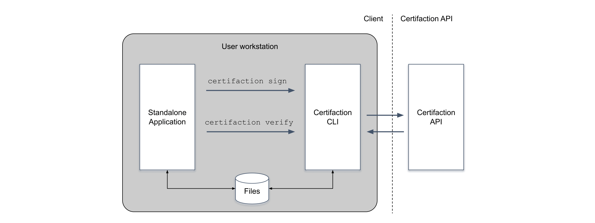

# Installation

Verwenden Sie den Certifaction-Client für die Integration mit Certifaction.
Die Verwendung des Clients stellt sicher, dass Ihre Dokumente lokal verarbeitet werden und niemals
im Klartext gesendet werden.

## Anforderungen

Der Certifaction-Client wird als ausführbare Datei verteilt, die mit aktuellen Linux-,
Windows- und macOS-Betriebssystemen kompatibel ist und in einem Docker-Container ausgeführt werden kann.

Der Client benötigt Zugriff auf die Certifaction-API und ein Authentifizierungstoken für die meisten
seiner Befehle.

Beim Ausführen des Clients als Lokale API hört die ausführbare Datei auf HTTP-Ports,
die für Client-Anwendungen zugänglich sein müssen.

## Installation

Laden Sie den Certifaction-Client von unserem [öffentlichen Repository](https://github.com/certifaction/cli/releases) herunter.

Bitte erstellen Sie ein [Issue](https://github.com/certifaction/cli/issues), wenn Sie
keine ausführbare Datei für Ihre Plattform finden.

## Verwendung

Sie können den Certifaction-Client als Lokale API oder als CLI verwenden.
In beiden Fällen können Sie ein oder mehrere Dokumente signieren und externe
Unterzeichner einladen.

### Verwendung des Clients als Lokale API

Möchten Sie die Lokale API einfach ausprobieren? Gehen Sie direkt zum [Lokale API Schnellstart](./getting-started-api).

In diesem Szenario starten Sie die Lokale API, entweder
direkt auf einem Knoten oder einer VM, oder in einem Docker-Container. Der Client verwendet
HTTP, um Dokumente zu signieren, mit der Garantie, dass Dokumente die
lokale Umgebung nicht verlassen. Dies ist die beste Option für zentralisierte Dokumentsignaturen, bei denen Dokumente während eines automatisierten Dokumentenworkflows signiert werden.

### Verwendung des Clients als Kommandozeilenschnittstelle

Möchten Sie die CLI einfach ausprobieren? Gehen Sie direkt zum [CLI-Schnellstart](./getting-started-cli).

Verwenden Sie den Client als Kommandozeilenschnittstelle (CLI) für Desktop-Automatisierung oder zur Integration von Certifaction
in eine Standalone-Anwendung.

Standalone-Anwendungen können die ausführbare Certifaction-Datei direkt aufrufen, um Dokumente zu signieren oder
Signaturen von anderen Personen anzufordern.

Dokumente können entweder im Dateisystem gespeichert und geladen werden, oder sie können über die
Standardeingabe und -ausgabe an den Befehl übergeben werden.

