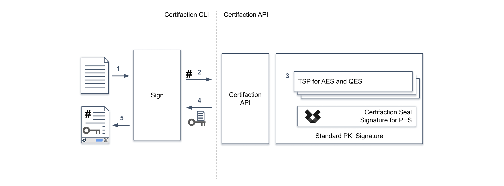

# Signature Numérique

La signature numérique de Certifaction permet aux utilisateurs d'ajouter une ou plusieurs signatures numériques aux documents PDF.

Les signatures de documents Certifaction sont basées sur la norme [PAdES](https://en.wikipedia.org/wiki/PAdES),
qui utilise la cryptographie et l'Infrastructure à Clé Publique (PKI) pour fournir la plus haute garantie contre la contrefaçon.

Certifaction utilise trois niveaux de signature avec des assurances de vérification d'identité croissantes :

- Signature Électronique Simple (SES) : vérification par email
- Signature Électronique Avancée (AES) : exigences de vérification renforcées
- Signature Électronique Qualifiée (QES) : exigences de signature électronique qualifiée suisse et européenne

La signature unique de Certifaction axée sur la confidentialité garantit que le contenu du document ne quitte pas votre
infrastructure informatique en texte clair.

## Signature simple de document

Voici les étapes lors d'une signature simple de document :

1.  Le CLI reçoit le document PDF à signer et le traite (ajoute des fonctionnalités de sécurité incluant une URL sécurisée unique et une ou plusieurs pages de
    signature).
2.  Le hash du fichier est envoyé à l'API Certifaction pour signature.
3.  L'API Certifaction utilise l'un de ses fournisseurs de signature modulaires selon le niveau de signature et la juridiction.
4.  L'API Certifaction retourne la signature PKCS #7 CMS au CLI.
5.  Le CLI intègre la signature dans le document PDF et le retourne à l'utilisateur.

Des signatures supplémentaires peuvent être ajoutées à un document déjà signé de manière séquentielle. Envoyer un document signé à un
autre signataire est une option simple et valide.

