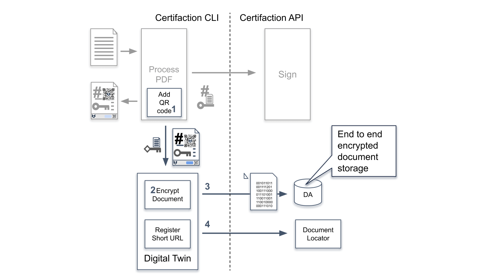

# Jumeau Numérique Certifaction

Vous pouvez sécuriser vos documents imprimés avec un [Jumeau Numérique](https://certifaction.com/digital-twin/).
Les Jumeaux Numériques connectent les documents imprimés à leurs originaux numériques.
De cette façon, vous pouvez télécharger la copie numérique stockée de manière sécurisée sur votre appareil, vérifier son authenticité,
et éliminer tout risque de fraude documentaire.

Comment fonctionne le Jumeau Numérique :

1.  Avant la signature, une URL unique et sécurisée est créée et ajoutée au document avec un code QR.
2.  Le document est chiffré.
3.  La copie chiffrée est stockée dans l'Archive Numérique Certifaction (DA).
4.  L'URL du Jumeau Numérique est enregistrée dans le localisateur de documents Certifaction.

