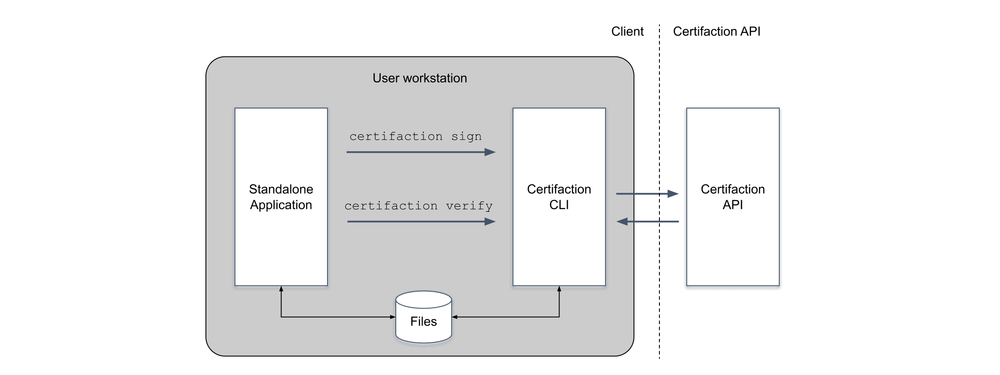

# Traitement Local

Le traitement local des documents garantit la confidentialité des documents.

Le Client Certifaction peut être utilisé dans deux modes :

- Mode serveur qui expose une API Locale.
- Interactif pour exécuter des commandes sur le shell, dans le cadre d'un script ou depuis une application tierce.

Dans les deux cas, le Client Certifaction sert de proxy entre l'application tierce et l'API
Certifaction. Il gère la signature, la certification, la vérification et la révocation des documents sans
divulguer le contenu du document en dehors de votre infrastructure informatique contrôlée.

## Exécuter l'API Locale sur un nœud

Dans ce scénario, vous démarrerez l'API Locale, soit
directement dans un nœud ou une VM, soit dans un conteneur Docker. Le Client utilisera
HTTP pour signer des documents avec la garantie que les documents ne quittent pas
l'environnement local. C'est la meilleure option pour les signatures de documents centralisées
où les documents sont signés pendant un flux de travail de documents automatisé.

## Intégration d'application autonome

En plus d'être un utilitaire en ligne de commande utile, le CLI peut être utilisé par
des applications autonomes pour signer et certifier des documents avec Certifaction sans avoir à
s'intégrer et se lier à des bibliothèques externes.

Les applications autonomes appellent le CLI Certifaction pour signer des documents sur le
système de fichiers ou en utilisant l'entrée et la sortie standard.

