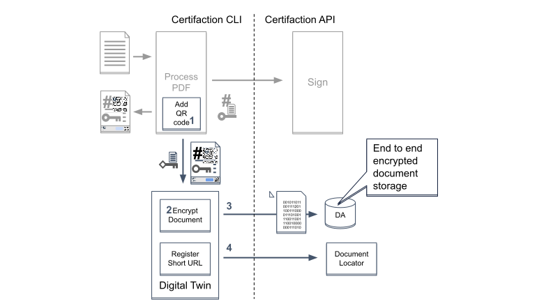

# Certifaction Digital Twin

In addition to storing the secure URL inside the PDF as custom information, a Digital Twin QR code can be added
to the document. This QR code contains the secure URL that can be used to retrieve the encrypted version of
document stored in Certifaction servers.

When printing the document, the visible QR code can be scanned to retrieve the last version of the document.
Certifaction Digital Twin bridges the world of printed and digital documents.

Here are the steps to store an encrypted version of the document and return a Digital Twin URL:

1.  Before signature, a unique and secure URL created and added to the document with a QR code
2.  The document is encrypted
3.  The encrypted copy is stored in Certifaction Digital Archive (DA)
4.  The Digital Twin URL is recorded in Certifaction document locator

