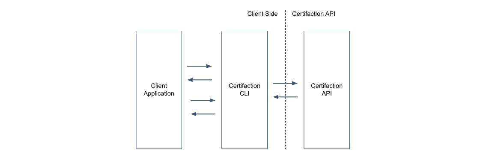
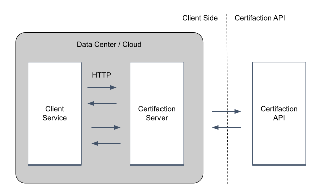
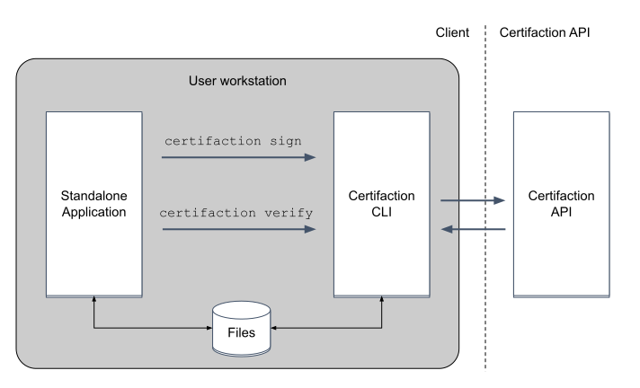

# Local Processing

Local document processing is Certifaction unique strength.

Certifaction client can be used in two modes:

- Server mode that exposesa Local API.
- Interactive to execute commands on the shell, as part of a script or from a third party application.

In both cases, the client sits between the third party application and Certifaction
API and handles document signing, certification, verification and revocation without
leaking the document content outside your controlled IT infrastructure.

## Running the Local API on a node

In this scenario, the Certifaction client is started in server mode, either
directly in a node or VM, or inside a Docker container. The client will use
HTTP to sign and verify documents with the guarantee that documents do not leave
the client IT system. This is the best option for centralized document
signature where documents are signed during an automated document workflow.

## Standalone application integration

In addition to being a useful command line utility, the CLI can be used by
standalone applications to sign and certify documents with Certifaction without having to
integrate and link to external libraries.

Standalone applications calls Certifaction CLI to sign documents on the
file system or using the standard input and output.

